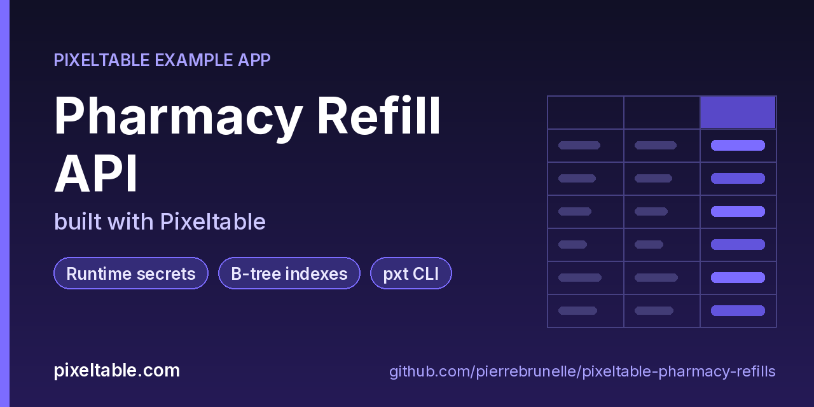

<!-- pixeltable-example-app: 20261006-pharmacy-refills -->
# Pharmacy Refill API built with Pixeltable



[](https://codespaces.new/pierrebrunelle/pixeltable-pharmacy-refills?quickstart=1)
[](https://pixeltable.com)
[](https://pypi.org/project/pixeltable/)
[](https://github.com/pixeltable/pixeltable)
[](LICENSE)

A refill queue for a pharmacy counter. Prescriptions are keyed by Rx number. Each refill request gets a **signed receipt**: an HMAC-SHA256 computed column keyed by `REFILL_SIGNING_KEY`, which the UDF reads from the environment at runtime, so the key never lands in code, the schema or git. When staff move a request from `requested` to `ready` or `picked-up`, the receipt is re-signed automatically. Four **B-tree indexes** keep the queue and per-patient lookups fast. All data in this example is synthetic.

[Pixeltable](https://pixeltable.com) is open-source, Python-native **multimodal AI data infrastructure**: tables, incremental computed columns, UDFs, indexes and serving in one library, running locally or on Pixeltable Cloud.

> ⭐ **Like this example?** Star [pixeltable/pixeltable](https://github.com/pixeltable/pixeltable) on GitHub. It helps other developers find it.

## What this example shows

- **Secrets** set with `pxt secret set` and read at runtime, never hard-coded
- **B-tree indexes** declared on the model (`__indexes__`) back the lookup queries
- **`pxt` CLI and local dashboard** for exploring tables and computed columns
- **Incremental computed columns** powered by plain Python UDFs (`@pxt.udf`)
- **FastAPI serving**: one `FastAPIRouter` turns tables and `@pxt.query` functions into typed REST routes (insert, update, delete, compute and query) with OpenAPI docs
- **Importable UDF module**: UDFs live in `udfs.py`; tables, queries and routes live together in `app.py` (Pixeltable resolves UDFs by module path)
- **`pixeltable.toml`** declares a local database and a **Pixeltable Cloud** database, so the same code deploys with `pxt db update`

## The signing key

```python
# udfs.py
key = os.environ.get('REFILL_SIGNING_KEY')
if not key:
    raise RuntimeError('REFILL_SIGNING_KEY is not set')
```

| Where it runs | How the key gets there |
|---------------|------------------------|
| Local | `export REFILL_SIGNING_KEY=...`, then start the service with `pxt service run` **from that same shell** so the process inherits it |
| Pixeltable Cloud | `pxt secret set pxt://<your-org>:<your-db> REFILL_SIGNING_KEY=<value>`, then `pxt db restart pxt://<your-org>:<your-db>` (secrets are picked up on restart). `pxt secret list` shows names and scopes, never values |

To rotate it, set the new value and restart. Receipts are signed when a row is written or updated, so existing receipts keep their old signature until the row changes. If the key is missing, writes fail instead of storing unsigned receipts. Don't use the reserved `PIXELTABLE_` prefix for your own secrets.

## Indexes and the CLI

`prescriptions` indexes `patient_ref` and `drug`, and `refills` indexes `rx_number` and `status` (all with `has_default_idxs=False`). Explore them from the terminal:

```bash
pxt idxs pharmacy/refills          # the indexes
pxt computed pharmacy/refills      # computed columns and their expressions
pxt rows pharmacy/refills -n 5     # a few rows
pxt get pharmacy/prescriptions RX-100231
pxt dashboard                      # open the local dashboard
```

## What's inside

| File | What it is |
|------|------------|
| `.devcontainer/devcontainer.json` | GitHub Codespaces / Dev Container config: Python 3.12, installs `requirements.txt`, forwards port 8000 |
| `.github/social-preview.png` | Social preview image (1280x640) |
| `CITATION.cff` | Citation metadata (authors, license, release date, keywords) |
| `app.py` | The app: tables declared as Python classes, `@pxt.query` functions, and the `FastAPIRouter` routes |
| `client_demo.py` | Sign, request, advance and query refills through the API (the service needs REFILL_SIGNING_KEY) |
| `pixeltable.toml` | Project config: the local database plus a Pixeltable Cloud database (sizing, deploy excludes) |
| `seed.py` | Seed synthetic prescriptions and refill requests (needs REFILL_SIGNING_KEY in the environment) |
| `udfs.py` | Pixeltable UDFs (`@pxt.udf`) in their own importable module, imported by `app.py` |
| `requirements.txt` / `pyproject.toml` | Dependencies (`pixeltable[serve]>=0.7.14`) |

**Tables**

| Table | Stored columns | Computed columns |
|-------|---------|------------------|
| `prescriptions` | `rx_number`, `patient_ref`, `drug`, `refills_left`, `prescriber` | `state` |
| `refills` | `rx_number`, `patient_ref`, `requested_at`, `channel`, `status` | `id`, `label`, `receipt_sig` |

**API routes** (service `refill_api`)

| Method | Path | Kind | Backed by | Notes |
|--------|------|------|-----------|-------|
| `POST` | `/prescriptions` | insert | `Prescriptions` |  |
| `POST` | `/refills` | insert | `Refills` |  |
| `POST` | `/refills/status` | update | `Refills` |  |
| `POST` | `/sign` | compute | `Refills` |  |
| `GET` | `/refills/queue` | query | `queue` |  |
| `GET` | `/patients/prescriptions` | query | `patient_prescriptions` |  |

## Run in your browser (GitHub Codespaces)

[](https://codespaces.new/pierrebrunelle/pixeltable-pharmacy-refills?quickstart=1)

1. Click **Open in GitHub Codespaces** above (or [this link](https://codespaces.new/pierrebrunelle/pixeltable-pharmacy-refills?quickstart=1)). The dev container installs Python 3.12 and `pixeltable[serve]>=0.7.14` from `requirements.txt`.
2. In the codespace terminal, create the tables, seed them and start the API:

   ```bash
   pxt schema update app.py pharmacy
   export REFILL_SIGNING_KEY=<any-long-random-string>   # read by udfs.receipt_signature at runtime
   python seed.py pharmacy
   pxt service run app.py pharmacy --port 8000   # same shell, so the service sees the key
   python client_demo.py                        # in another terminal
   ```

3. Codespaces forwards port 8000: open it from the **Ports** tab (or the pop-up) and add `/docs` to the URL for the interactive OpenAPI docs.

This app reads `REFILL_SIGNING_KEY` at runtime. Add it as a [Codespaces secret](https://docs.github.com/codespaces/managing-your-codespaces/managing-your-account-specific-secrets-for-github-codespaces) (the dev container recommends it when you create the codespace) or `export` it in the terminal before starting the service.

## Quickstart

Requires Python 3.11+ and `pixeltable[serve]>=0.7.14`.

```bash
git clone https://github.com/pierrebrunelle/pixeltable-pharmacy-refills.git
cd pixeltable-pharmacy-refills
python -m venv .venv && source .venv/bin/activate
pip install -r requirements.txt

# Create the tables in a local catalog directory named `pharmacy`
pxt schema update app.py pharmacy

export REFILL_SIGNING_KEY=<any-long-random-string>   # read by udfs.receipt_signature at runtime
python seed.py pharmacy
pxt service run app.py pharmacy --port 8000   # same shell, so the service sees the key
python client_demo.py                        # in another terminal
```

Try it:

```bash
curl -s 'localhost:8000/refills/queue?status=requested'
curl -s 'localhost:8000/patients/prescriptions?patient_ref=P-7f3a'
```

## Deploy to Pixeltable Cloud

The same `app.py` runs on [Pixeltable Cloud](https://pixeltable.com). Sign in (or get a free trial database with `pxt new`), point the second database entry in `pixeltable.toml` at your own database, then deploy:

```bash
pxt login                       # or: export PIXELTABLE_API_KEY=<your-api-key>
# edit pixeltable.toml: name = 'pxt://<your-org>:<your-db>'
pxt db update pxt://<your-org>:<your-db>                 # build the image and upload the project
pxt schema update app.py pxt://<your-org>:<your-db>/pharmacy   # create the tables in the hosted database
pxt service update app.py pxt://<your-org>:<your-db>/pharmacy  # start the API there
pxt service list pxt://<your-org>:<your-db>              # list hosted services
```

Hosted routes require an API key: send it in the `X-api-key` header (for example `-H "X-api-key: $PIXELTABLE_API_KEY"`). Keep keys in environment variables or `pxt secret set`, never in code.

## Code walkthrough

**1. Business logic is plain Python, in `udfs.py`.** A `@pxt.udf` function can be used as a column expression. Pixeltable records UDFs by module path (`udfs.receipt_signature`), so they live in their own importable module rather than inline in the app: the daemon, serving workers and Pixeltable Cloud import it again by that path.

```python
# udfs.py
@pxt.udf
def receipt_signature(rx_number: str, requested_at: str, status: str) -> str:
    """HMAC-SHA256 over 'rx|requested_at|status', keyed by REFILL_SIGNING_KEY."""
    key = os.environ.get('REFILL_SIGNING_KEY')
    if not key:
        raise RuntimeError('REFILL_SIGNING_KEY is not set')
    msg = f'{rx_number}|{requested_at}|{status}'.encode()
    return hmac.new(key.encode(), msg, hashlib.sha256).hexdigest()[:32]
```

**2. Tables are Python classes (`app.py`).** Annotated attributes are stored columns; attributes assigned an expression are **computed columns** (`id`, `label`, `receipt_sig`), evaluated incrementally on every insert or update and recomputed when their inputs change. Indexes live next to the columns.

```python
# app.py
class Refills(TableModel, name='refills', has_default_idxs=False):
    id = pxt.Column(value=pxtf.uuid.uuid7(), primary_key=True)
    rx_number: pxt.String
    patient_ref: pxt.String
    requested_at: pxt.String
    channel: pxt.String              # counter / app / drive-thru
    status: pxt.String               # requested / ready / picked-up

    label = status_label(status, channel)
    receipt_sig = receipt_signature(rx_number, requested_at, status)   # re-signed when status changes

    __indexes__ = [pxt.BtreeIndex(rx_number), pxt.BtreeIndex(status)]
```

**3. Queries are functions (`app.py`).** `@pxt.query` wraps a Pixeltable query so it can be called from Python or exposed as a route:

```python
# app.py
@pxt.query
def queue(status: str):
    """Refills in one status, oldest request first (status index)."""
    return Refills.where(Refills.status == status).select(
        Refills.id, Refills.rx_number, Refills.requested_at, Refills.label
    ).order_by(Refills.requested_at)
```

**4. One router, a full REST API.** `FastAPIRouter` generates request/response models from the column types, validates input, and publishes OpenAPI docs at `/docs`:

```python
# app.py
refill_api = FastAPIRouter(name='refill_api')
refill_api.add_insert_route(
    Prescriptions, path='/prescriptions',
    inputs=[Prescriptions.rx_number, Prescriptions.patient_ref, Prescriptions.drug, Prescriptions.refills_left,
            Prescriptions.prescriber],
    outputs=[Prescriptions.rx_number, Prescriptions.state],
)
refill_api.add_insert_route(
    Refills, path='/refills',
    inputs=[Refills.rx_number, Refills.patient_ref, Refills.requested_at, Refills.channel, Refills.status],
    outputs=[Refills.id, Refills.label, Refills.receipt_sig],
)
refill_api.add_update_route(Refills, path='/refills/status', inputs=[Refills.status],
                            outputs=[Refills.id, Refills.label, Refills.receipt_sig])
refill_api.add_compute_route(Refills, path='/sign',
                             inputs=[Refills.rx_number, Refills.requested_at, Refills.status],
                             outputs=[Refills.receipt_sig])
refill_api.add_query_route(path='/refills/queue', query=queue, method='get')
refill_api.add_query_route(path='/patients/prescriptions', query=patient_prescriptions, method='get')
```

## Learn more

- 🌐 Website: https://pixeltable.com
- 📚 Docs: https://docs.pixeltable.com
- 💻 Source: https://github.com/pixeltable/pixeltable (⭐ star it if Pixeltable is useful to you)
- 📦 PyPI: https://pypi.org/project/pixeltable/
- 🧩 More example apps: https://pierrebrunelle.github.io/awesome-pixeltable-apps/

**[More Pixeltable example apps →](https://pierrebrunelle.github.io/awesome-pixeltable-apps/)**

---

<sub>Built as part of a daily series of Pixeltable example apps · Pixeltable 0.7.14 · Python, FastAPI, incremental computed columns · Licensed under Apache-2.0.</sub>
